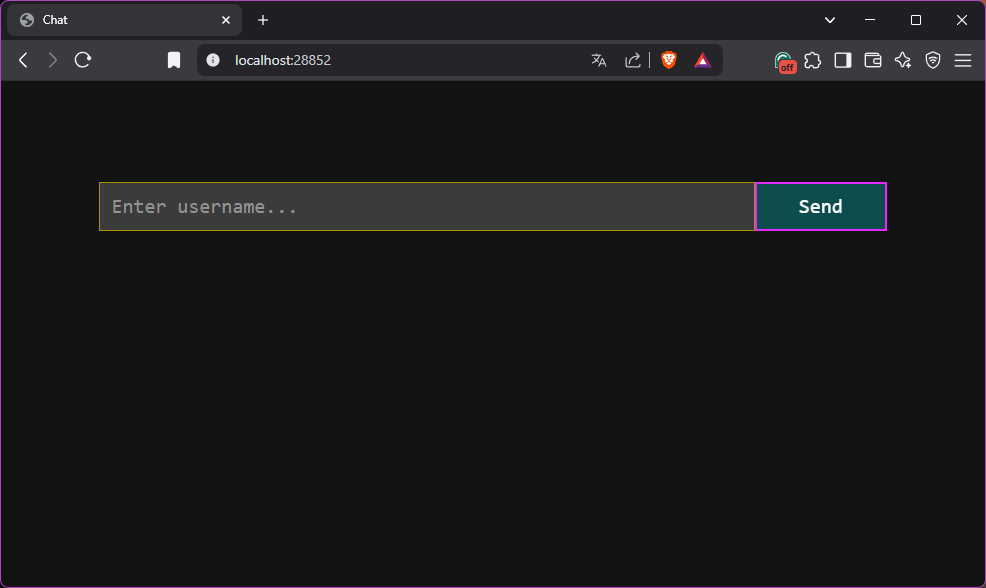
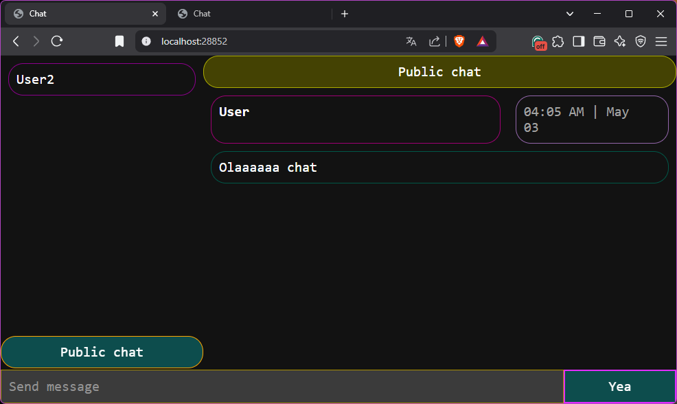
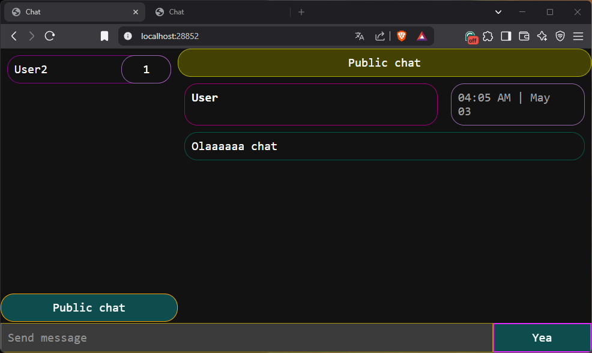
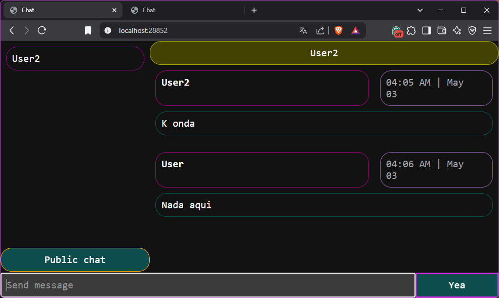

# Real-time Chat Application

A Spring Boot-based real-time chat application that supports both public and private messaging using WebSockets.

## Project Overview

This application provides a real-time chat platform where users can:
- Log in with a unique username
- Send and receive messages in a public chat room
- Send and receive private messages with specific users
- See notifications for unread messages
- View a list of currently online users

The application uses Spring Boot for the backend, WebSockets for real-time communication, and a simple HTML/CSS/JavaScript frontend.

## Project Structure

### Source Code (`src` folder)

#### Main Application

- **Main.java** - The entry point for the Spring Boot application.

#### Business Logic (`business` package)

- **BrrBrokerConfig.java** - WebSocket configuration class that sets up the message broker, endpoints, and handlers.
- **Chat.java** - Represents a chat conversation between users, storing users and their messages.
- **Deam.java** - Represents a user in the system with a unique identifier.
- **GodDeam.java** - Represents a chat message with sender, content, and timestamp.
- **ChatController.java** - Main controller handling REST endpoints and WebSocket messaging:
  - User authentication and management
  - Public and private message routing
  - Chat history retrieval
  - User presence management
- **MaiDeamHandler.java** - Custom WebSocket handshake handler that assigns unique identifiers to connections.

### Resources (`resources` folder)

#### Configuration

- **application.properties** - Spring Boot configuration file:
  - Server port (28852)
  - Actuator endpoints configuration
  - Shutdown endpoint enablement

#### Static Web Files (`static` folder)

- **index.html** - The main HTML structure for the chat application UI:
  - Login section
  - User list section
  - Message display area
  - Message input controls
- **script.js** - Client-side JavaScript handling:
  - WebSocket connection management
  - User interface interactions
  - Message sending and receiving
  - Chat switching between public and private
  - Notification management
- **style.css** - Styling for the chat application:
  - Layout and positioning
  - Colors and visual effects
  - Responsive design elements

## How to Build and Run

### Prerequisites

- Java 17 or higher
- Gradle

### Building the Application

```bash
./gradlew build
```

### Running the Application

```bash
./gradlew bootRun
```

Or after building:

```bash
java -jar build/libs/real-time-chat.jar
```

### Accessing the Application

Open a web browser and navigate to:

```
http://localhost:28852
```

## Usage

1. Enter a unique username and click "Send" or press Enter
2. Use the public chat by default to send messages to everyone
3. Click on a username in the user list to start a private conversation
4. Click "Public chat" to return to the public chat room
5. Notification counters will appear next to usernames when you have unread private messages

## Preview
### Login

### Public chat

### Other user login

### Message to public chat

### User receives notification

### User sends message back
